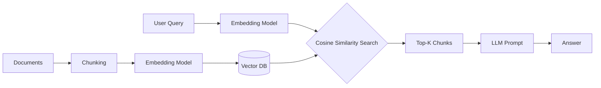
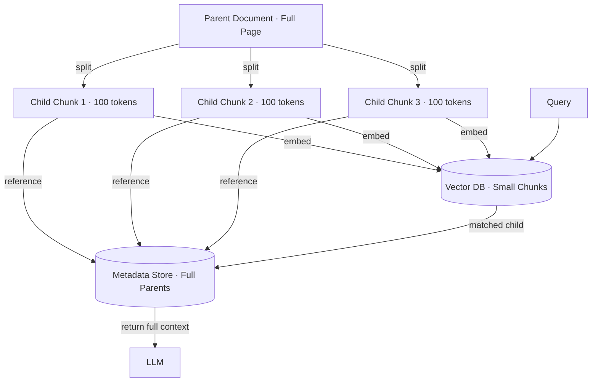
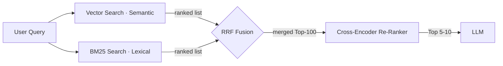
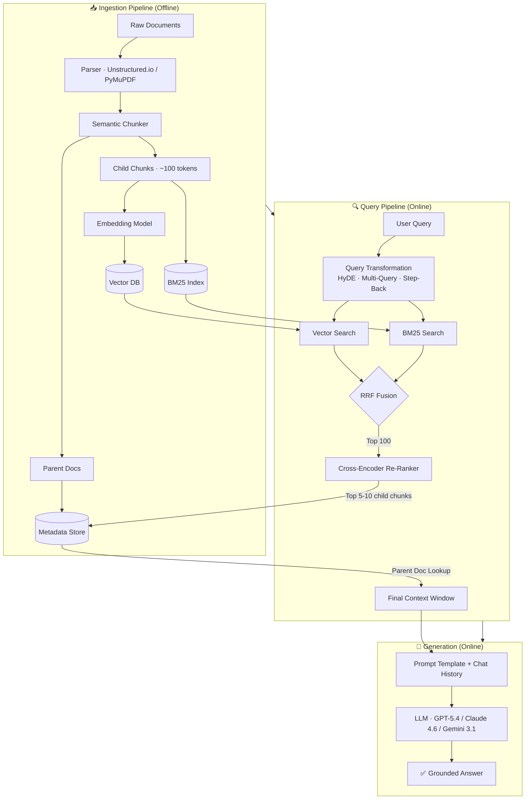

# All You Need to Know About RAG (in 2026)
> **Chunking, Re-Ranking, and Hybrid Search That Actually Work**  
> *Aishwarya Srinivasan — Mar 21, 2026*  
> Source: https://aishwaryasrinivasan.substack.com/p/all-you-need-to-know-about-rag-in

---

## RAG Fundamentals

### What is RAG?
**Retrieval-Augmented Generation (RAG)** is an architecture pattern that connects large language models to external knowledge bases, allowing them to answer questions based on specific documents rather than relying solely on training data.

### Core RAG Tooling
| Tool Category | Popular Options |
|---|---|
| **Orchestration Frameworks** | LangChain, LlamaIndex |
| **Embedding Models** | OpenAI `text-embedding-3-large`, Cohere Embed v3, BGE-M3 |
| **Vector Databases** | Pinecone, Weaviate, Qdrant, Milvus, ChromaDB |
| **Re-Rankers** | Cohere Rerank 3.5, BGE-Reranker-v2 |
| **LLMs** | GPT-5.4, Gemini 3.1 Pro, Claude 4.6 |

### Supported Document Types
PDFs, Reports, Markdown, CSV, JSON, HTML, PPTX, DOCX, XLSX, Email, and more.

### How the Pipeline Works
1. **Ingest** — Documents are parsed, chunked, and embedded into vectors.
2. **Store** — Vectors are stored in a vector database alongside metadata.
3. **Query** — User question is converted to a vector using the same embedding model.
4. **Retrieve** — Most relevant chunks are fetched via similarity search.
5. **Augment** — Retrieved context is injected into the LLM prompt.
6. **Generate** — The LLM produces a grounded, context-aware answer.

---

## The 2026 State of RAG

The "Hello World" of RAG is officially dead. In 2024, it was enough to shove some PDFs into a vector database, run a cosine similarity search, and call it a day. In 2026, that approach — **Naive RAG** — is seen as a prototype at best and a liability at worst.

As we push the limits of next-generation models like GPT-5.4, Gemini 3.1 Pro, and Claude 4.6, the bottleneck has shifted. We no longer struggle with the *Generation* part — these models are hyper-intelligent. **The failure point is almost always the Retrieval.**

We are moving beyond the "vibe-check" of vector search and into the rigorous world of high-precision **Information Retrieval (IR)**.

---

## Agenda

1. [The Vanilla RAG — Why Naive RAG Fails](#1-the-vanilla-rag)
2. [Advanced Chunking Strategies](#2-advanced-chunking-strategies)
3. [Hybrid Search & Reciprocal Rank Fusion](#3-hybrid-search--reciprocal-rank-fusion-rrf)
4. [The Re-Ranking Algorithm](#4-the-re-ranking-algorithm)
5. [Query Transformation & Expansion](#5-query-transformation--expansion)
6. [Operational Economics: RAG vs. Long-Context](#6-operational-economics-rag-vs-long-context)
7. [The Master Architecture](#7-the-master-architecture)
8. [Linkstash — 2026 Technical Library](#8-linkstash--2026-technical-library)

---

## 1. The Vanilla RAG

Naive RAG follows a linear, fragile path:

```
Index → Query → Retrieve → Augment → Generate
```



### Why It Fails

Bi-encoder vector embeddings are **"lossy" by design**. They compress a complex paragraph into a single point in a 1536-dimensional space. This is great for finding *concepts* but catastrophic for finding *specifics*.

> **Example:** If a user asks "Compare the Q3 2025 revenue of the Cloud division vs. the Q3 2024 baseline," a standard vector search might return the **2024** data because the semantic distance between "2024" and "2025" is negligible to an embedding model. To the LLM, however, that one-digit difference is the difference between a correct insight and a hallucination.

---

## 2. Advanced Chunking Strategies

Stop splitting your text by character count. Fixed-sized chunking is the "Vibe-Eval" of data prep. In 2026, we utilize **Context-Aware Partitioning**.

### A. Semantic Chunking

Instead of breaking at 500 characters, we use a model to look at the embeddings of subsequent sentences. If the **cosine distance** between Sentence A and Sentence B exceeds a specific threshold, it indicates a thematic shift — the system breaks the chunk there.

✅ Every chunk passed to the LLM is a **coherent, self-contained thought**.

```
Sentence 1 ──embed──► [vec_A]
Sentence 2 ──embed──► [vec_B]  cosine_distance(A,B) > threshold → SPLIT HERE
Sentence 3 ──embed──► [vec_C]
Sentence 4 ──embed──► [vec_D]  cosine_distance(C,D) < threshold → CONTINUE
```

### B. The "Small-to-Big" (Parent-Document) Strategy

This is a game-changer for precision.

| Step | What Happens |
|---|---|
| **Index** | Embed small, granular **child chunks** (~100 tokens). Easy for the vector DB to match with high precision. |
| **Retrieval** | When a child chunk is hit, retrieve the full **Parent Document** (whole page or section) from a metadata store. |
| **Benefit** | Surgical precision of small-chunk search + rich context of large-document generation. |



### C. Chunking Strategy Comparison (2026)

| Strategy | Description | Best For |
|---|---|---|
| Fixed-Size | Split at N characters/tokens | ❌ Baseline/prototype only |
| Recursive Character | Split by `\n\n`, `\n`, ` ` hierarchically | Simple docs |
| Semantic | Split on embedding cosine distance | ✅ General purpose |
| Small-to-Big (Parent-Doc) | Embed small, retrieve large | ✅ Long documents |
| Sentence Window | Embed sentence, retrieve surrounding window | ✅ Dense, narrative text |
| Agentic / Proposition | LLM decomposes into atomic facts | ✅ Maximum accuracy |

---

## 3. Hybrid Search & Reciprocal Rank Fusion (RRF)

Despite the neural revolution, **BM25 (keyword search) remains undefeated** for finding specific product codes, legal terminology, or unique acronyms.

Modern production systems use **Hybrid Search**: run Vector Search (semantic meaning) and BM25 Search (lexical exactness) in **parallel**, then merge results.

### Reciprocal Rank Fusion (RRF)

```
RRF(d) = Σ  1 / (k + rank_r(d))
         r∈R
```

Where `k = 60` is the standard constant.

- If a document appears in the **Top 5 of both** search types → it receives a massive mathematical boost.
- Effectively filters out the "semantic noise" that plagues pure vector databases.



---

## 4. The Re-Ranking Algorithm

> **This is the most critical step most builders miss.**

| Encoder Type | Speed | Accuracy | Use Case |
|---|---|---|---|
| **Bi-Encoder** | ⚡ Fast | Medium | Initial retrieval from vector DB |
| **Cross-Encoder** | 🐢 Slower | 🎯 Hyper-accurate | Re-ranking Top-N candidates |

A **Cross-Encoder** takes the `(Query, Document)` pair and processes them **simultaneously** through a transformer. It doesn't look at vectors — it looks at the actual relationship between words.

### The 2026 Production Pipeline

```
Step 1: Hybrid Search      →  Top 100 candidates   (Cheap & Fast)
Step 2: Cross-Encoder      →  Top 5–10 results      (Slow & Precise)
Step 3: LLM Generation     →  Grounded Answer
```

This eliminates the **"Lost in the Middle"** phenomenon, where models ignore information buried deep in a long list of retrieved results.

**Recommended Re-Rankers:**
- Cohere Rerank 3.5
- BGE-Reranker-v2-m3
- Jina Reranker v2
- FlashRank (lightweight, local)

---

## 5. Query Transformation & Expansion

The user's question is often the **weakest link**. If they ask *"What were the sales in Q3?"*, the system might not know which year or product line to focus on.

### A. HyDE — Hypothetical Document Embeddings

Ask the LLM to *generate a hypothetical answer* first, then embed **that** to search the vector DB.

```
User Query: "How does attention work in transformers?"
    ↓ LLM generates a hypothetical answer
Hypothetical: "Attention in transformers works by computing query, key,
               value matrices and applying softmax-scaled dot-product..."
    ↓ Embed the hypothetical answer (not the raw query)
Vector Search → Semantically richer, more relevant results
```

### B. Multi-Query Expansion

Rewrite the query into **3–5 different phrasings**, run each in parallel, and merge results with RRF.

```
Original:     "benefits of RAG"
Rephrased 1:  "why use retrieval augmented generation"
Rephrased 2:  "advantages of RAG over fine-tuning"
Rephrased 3:  "when should I use RAG in production"
    ↓ All queries run in parallel
    ↓ Merge with RRF
    → Richer, more comprehensive retrieval
```

### C. Step-Back Prompting

Ask the LLM to generate a **higher-level, more abstract question** first to retrieve broader context, then answer the specific original question.

```
Specific:  "What is the dropout rate in BERT-large?"
Step-back: "What are the key architectural design choices in large transformer models?"
    ↓ Retrieve context for the abstract question first
    ↓ Then answer the specific question with that broader grounding
```

### D. Query Decomposition (Agentic RAG)

Break complex questions into **sub-questions**, retrieve context for each independently, then synthesize a final answer.

```
Complex: "Compare LlamaIndex vs LangChain chunking — which is better for legal docs?"
    ↓ Decompose
Sub-Q 1: "What chunking strategies does LlamaIndex support?"
Sub-Q 2: "What chunking strategies does LangChain support?"
Sub-Q 3: "What are best practices for chunking legal documents?"
    ↓ Retrieve + Answer each
    ↓ Synthesize final comparative answer
```

---

## 6. Operational Economics: RAG vs. Long-Context

With models like Gemini 3.1 Pro supporting **2M+ token context windows**, the question becomes: *Why chunk at all — why not just dump everything in the context?*

### The Trade-off Matrix

| Factor | RAG | Long-Context (Full Doc) |
|---|---|---|
| **Latency** | ✅ Low — only relevant chunks sent | ❌ High — entire corpus processed |
| **Cost per Query** | ✅ Low — few hundred tokens to LLM | ❌ Very High — millions of tokens |
| **Accuracy** | ✅ High (with re-ranking) | ⚠️ "Lost in the Middle" risk |
| **Knowledge Freshness** | ✅ Update index without reprocessing | ❌ Must re-process entire context |
| **Data Privacy** | ✅ Data stays in your VectorDB | ⚠️ Full corpus sent to LLM API |
| **Scale** | ✅ Millions of documents | ❌ Hard-limited by context window |
| **Setup Complexity** | ❌ Higher — pipeline to build | ✅ Low — just stuff the context |

### Decision Rule (2026)

```
Corpus < 50 pages  AND  one-off / exploratory query  →  Long-Context  (simple, fast)
Corpus > 50 pages  OR   production system             →  Advanced RAG  (scalable, cost-efficient)
```

> **Key Insight:** Long-context is a great **fallback and validation tool**, not a production replacement for RAG. Use it to audit your RAG system's recall quality.

---

## 7. The Master Architecture

The complete production RAG pipeline for 2026:



### Architecture Component Summary

| Stage | Component | Purpose |
|---|---|---|
| **Parse** | Unstructured.io / PyMuPDF | Extract clean text from any format |
| **Chunk** | Semantic / Small-to-Big | Context-aware, coherent splitting |
| **Embed** | text-embedding-3-large / BGE-M3 | Dense vector representations |
| **Index** | Vector DB + BM25 | Dual-mode retrieval |
| **Transform** | HyDE / Multi-Query | Improve query quality before retrieval |
| **Retrieve** | Hybrid Search (RRF) | High recall |
| **Re-Rank** | Cross-Encoder | High precision |
| **Generate** | GPT-5.4 / Claude 4.6 | Grounded, faithful answers |

---

## 8. Linkstash — 2026 Technical Library

### Foundational Papers
| Resource | Topic |
|---|---|
| [Attention Is All You Need (2017)](https://arxiv.org/abs/1706.03762) | Transformer architecture |
| [REALM: Retrieval-Augmented LM Pre-Training (2020)](https://arxiv.org/abs/2002.08909) | Original RAG paper |
| [HyDE: Precise Zero-Shot Dense Retrieval (2022)](https://arxiv.org/abs/2212.10496) | Hypothetical Document Embeddings |
| [BGE-M3 (2024)](https://arxiv.org/abs/2402.03216) | Multi-lingual, multi-granularity embeddings |
| [RAPTOR: Recursive Abstractive Processing (2024)](https://arxiv.org/abs/2401.18059) | Tree-based hierarchical chunking |

### Libraries & Tools
| Library | Use Case |
|---|---|
| [LangChain](https://python.langchain.com) | RAG orchestration, chains, agents |
| [LlamaIndex](https://www.llamaindex.ai) | Advanced RAG patterns, data connectors |
| [Unstructured.io](https://unstructured.io) | Multi-format document parsing |
| [Qdrant](https://qdrant.tech) | High-performance vector database |
| [Cohere Rerank](https://cohere.com/rerank) | Production-grade re-ranking API |
| [FlashRank](https://github.com/PrithivirajDamodaran/FlashRank) | Lightweight local re-ranker |
| [BM25s](https://github.com/xhluca/bm25s) | Fast Python BM25 implementation |
| [Ragas](https://docs.ragas.io) | RAG evaluation framework |

### Evaluation Metrics
| Metric | What It Measures |
|---|---|
| **Context Recall** | Did retrieval find all the relevant chunks? |
| **Context Precision** | Are the retrieved chunks actually relevant? |
| **Faithfulness** | Does the answer stick to retrieved context (no hallucination)? |
| **Answer Relevancy** | Does the answer address the actual question? |
| **NDCG@K** | Ranking quality of retrieved documents |

---

## Quick Reference: Naive RAG vs. Advanced RAG

| Dimension | Naive RAG (2024) | Advanced RAG (2026) |
|---|---|---|
| **Chunking** | Fixed-size (500 chars) | Semantic / Small-to-Big |
| **Retrieval** | Vector search only | Hybrid: Vector + BM25 |
| **Ranking** | Cosine similarity | RRF + Cross-Encoder Re-rank |
| **Query** | Raw user input | HyDE / Multi-Query expansion |
| **Context Sent to LLM** | Raw child chunk snippets | Parent document lookup |
| **Evaluation** | Manual / vibes | Ragas, NDCG, Faithfulness scores |

---

*Last updated: April 2026*


## 9. RAG Patterns Summary

| Architecture | Core Idea | Strengths | Limitations / Trade-offs | Use Cases |
|---|---|---|---|---|
| **Simple RAG** | Retrieve top-k documents from a vector DB and feed them directly to the LLM. | Easy to implement, fast, widely supported. | No memory or deeper reasoning; limited to single query. | FAQ bots, basic knowledge search, doc Q&A. |
| **RAG with Memory** | Adds memory (short-term or long-term) to persist dialogue context or user history. | Natural multi-turn conversations, better continuity. | Memory management required; risk of drift and "memory bloat." | Chatbots, customer support, assistants. |
| **Branched RAG** | Retrieves from multiple sources (semantic, keyword, structured DBs), then merges. | Better recall, robust against retrieval gaps. | Complex merging; redundancy/conflicts possible. | Research assistants, compliance/legal, enterprise data search. |
| **HyDE** *(Hypothetical Document Embeddings)* | Generates a hypothetical document/query expansion before retrieval. | Boosts recall when queries are vague or sparse. | May hallucinate poor hypotheses; adds latency. | Scientific discovery, exploratory search, domain-specific queries. |
| **Adaptive RAG** | Dynamically chooses retrieval strategies (e.g., dense vs. sparse, multi-hop) based on query. | Flexible, context-sensitive retrieval, better efficiency. | Requires controller models; more complex to orchestrate. | General-purpose assistants, adaptive enterprise search. |
| **Corrective RAG** | LLM critiques retrieval results and corrects errors before generation. | Improves factuality, reduces irrelevant/incorrect context. | More compute cost; dependent on critique accuracy. | High-stakes QA, medical/legal, enterprise reporting. |
| **Self-RAG** | Model self-checks retrieved passages (critic + generator loop). | Improves reliability, reduces hallucinations. | Heavier compute; tuning required. | Mission-critical search, technical/coding copilots. |
| **Agentic RAG** | Retrieval is embedded in a multi-agent workflow (planner, retriever, generator, critic). | Strong reasoning, task decomposition, autonomous workflows. | Complex orchestration; higher infra needs. | Research agents, enterprise copilots, workflow automation. |
| **Multimodal RAG** | Retrieves from multimodal stores (text, image, video, audio, code). | Enables cross-modal reasoning, richer context. | Requires multimodal embeddings and infra; costly. | Video Q&A, image+text research, enterprise media search. |
| **Graph RAG** | Uses knowledge graphs / graph structures to represent and retrieve relationships. | Excels at multi-hop reasoning, entity/relationship grounding. | Requires graph construction & ongoing maintenance. | Biomedical RAG, enterprise KGs, scientific research assistants. |
